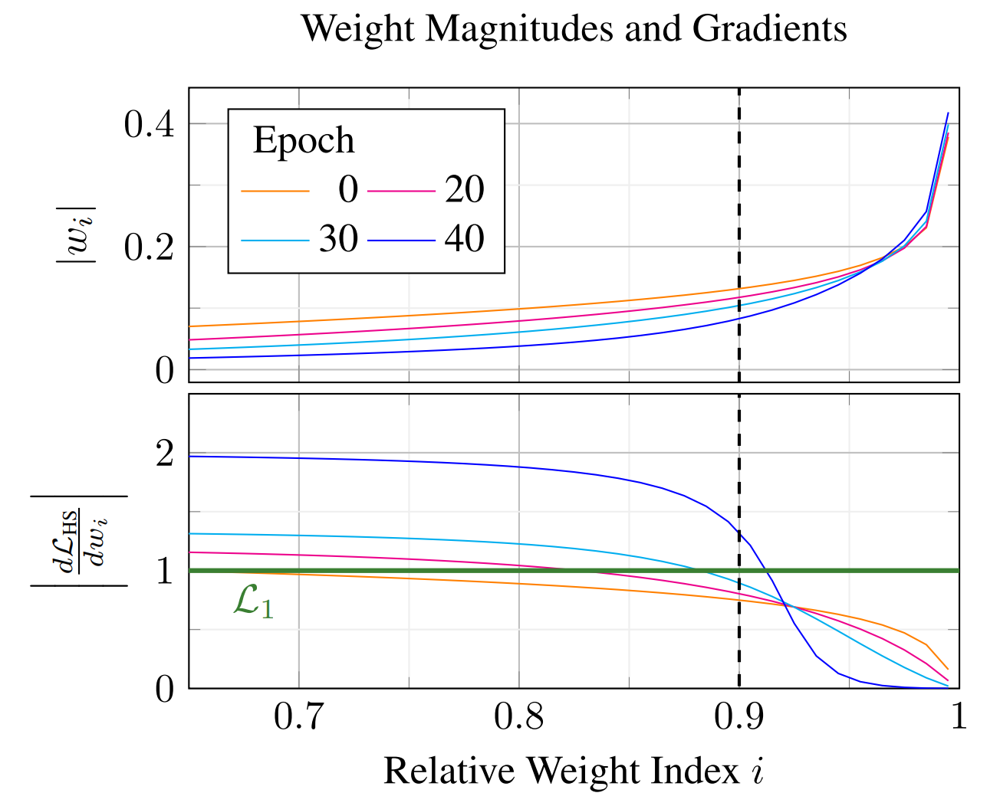

# HyperSparse Neural Networks: Shifting Exploration to Exploitation through Adaptive Regularization 




<b>[HyperSparse](https://arxiv.org/pdf/2308.07163)</b> is a novel regularization-loss for sparse neural networks that adaptively penalizes small weights with a higher regularization.
As shown in the figure above, weights with a small magnitude are regularized by factor 1 in earlier epochs which is comparable to the L1-Loss .
For weights beyond the given pruning-rate (&kappa;=90%), HyperSparse decreases smoothly to zero.
Looking the gradient behaviour over epoch e, the model-weights becomes sparse for small weights.
This results in an increasing gap of HyperSparse's gradient, as shown in epoch 40.

To sum up, Hypersparse has the following properties:
- smoothly decreasing gradient for weight above pruning-rate &kappa;
- point of inflections turns to be at the given pruning-rate 
- increasing gradient-gap between potentially pruned and remaining weights over epoch e
- creates well performing models in very high sparsity regimes 


As second contribution we present our trainings-schedule <b>ART (Adaptive Regularized Training)</b>.
ART increases the leverage of regularization until the pruned model performes comparable to the dense model.
In combination with our HyperSparse-Loss this results in well performing sparse models, especially in very high sparsity regimes.
The following table shows some results of ART using HyperSparse-Loss:

 | pruning-rate (&kappa;)   |   0%   |  90%   |  98%   | 99,5%  |
 |--------------------------|:------:|:------:|:------:|:------:|
 | Resnet32 on CIFAR10      | 94,70% | 94,22% | 92,69% | 89,35% | 
 | VGG19    on CIFAR10      | 93,84% | 93,93% | 93,75½ | 92,91% | 
 | Resnet32 on CIFAR100     | 74,60% | 74,08% | 70,08% | 59,58% | 
 | VGG19    on CIFAR100     | 72,88% | 73,23% | 71,83% | 69,02% | 
 | Resnet32 on TinyImageNet | 62,87% | 60,97% | 53,92% | 40,68% | 
 | VGG19    on TinyImageNet | 61,41% | 61,55% | 59,79% | 55,34% |


## Dependencies
Use the provided `environment.yml` file to create a conda environment for this project: 

```
$ conda env create -f environment.yml
$ conda activate hypersparse
```

## How to apply HyperSparse-Loss?

There are two types for using HyperSparse loss. 
1. add HyperSparse to the Basis-Loss
2. calculate the gradient of Hypersparse directly by `grad_HS_loss(model, prune_rate)` and add the regularization after backward step 

We recomment to use method 1, due to it's speedup in training.
A toy-example to this methods is described here:

### Method 1 (add Regularization to loss-term)
First calculate basis loss:
```
outputs = model(inputs)
loss_basis = criterion(outputs, targets)
optimizer.zero_grad()
```

After that HyperSparse-Loss must be added:
```
regularization_loss = hyperSparse(model, args.prune_rate)
alpha = args.lambda_init * (args.eta ** float(epoch - args.warmup_epochs))
loss_basis += alpha * regularization_loss

loss_basis.backward()
```

### Method 2 (add regularization gradient directly to each weight)

```
loss_basis.backward()

w_grad = grad_HS_loss(model, args.prune_rate)
alpha = args.lambda_init * (args.eta ** float(epoch - args.warmup_epochs))

for name, m in model.named_modules():
    if is_prunable_module(m):
        m.weight.grad += alpha * w_grad[name]
```

## Run Experiments using ART

Example for resnet32 on cifar10 using HyperSparse-Loss 

```
python train.py --model_arch="resnet" --model_depth=32 --dataset="cifar10" --prune_rate=0.9 --regularization_func="HS"
```

Example for vgg19 on cifar100 using HyperSparse-Loss 

```
python train.py --model_arch="vgg19" --model_depth=19 --dataset="cifar100" --prune_rate=0.9 --regularization_func="HS"
```

Example for resnet32 on cifar10 using Lx-Loss 

```
python train.py --model_arch="vgg" --model_depth=19 --dataset="cifar100" --prune_rate=0.9 --regulaization_func="L1"
python train.py --model_arch="vgg" --model_depth=19 --dataset="cifar100" --prune_rate=0.9 --regulaization_func="L2"
```


## Reference

If you find this work useful, please include the following citation:

```latex
@inproceedings{HyperSparse2023,
  title={HyperSparse Neural Networks: Shifting Exploration to Exploitation through Adaptive Regularization},
  author={Patrick Glandorf and Timo Kaiser and Bodo Rosenhahn},
  booktitle={Proceedings of the ICCVW International Conference on Computer Vision Workshop 2023},
  year={2023}
}
```